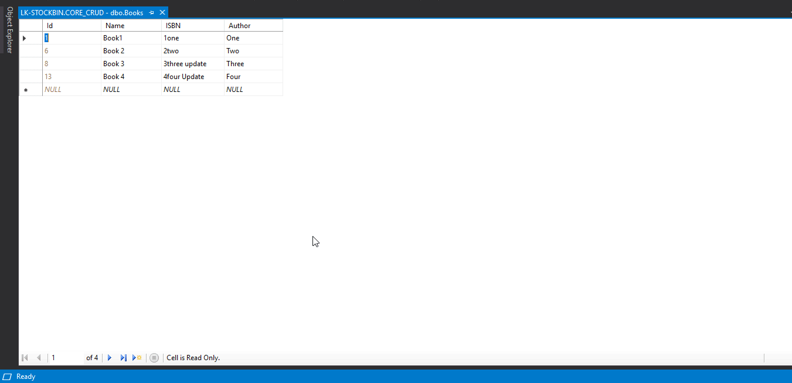

# Practicing-ASP.NET-Core-2.2-AJAX-RazorPages 👏

## Working with ASP.NET Core 2.2. Performing CRUD operations in Latest Razor Pages with AJAX.

### Passed Json Data to Action (OnGet, OnPost, OnPut, OnDelete) Using AJAX.

📑💫💻

## Proper Comments for Understanding & Readable Easy Code! "Written Separately!" 🤟🤟🤟

---

## Demo in Motion <u>**(Basic CRUD in Razor Pages with AJAX)**</u>: 😉

---

## 📄 License 🔐

Practicing-ASP.NET-Core-2.2-AJAX-RazorPages (ASP.NET-CORE-CRUD-RAZORPAGES-AJAX)
Copyright (C) 2019 - Arslan Ameer

This program is free software: you can redistribute it and/or modify
it under the terms of the GNU General Public License as published by
the Free Software Foundation, either version 3 of the License, or
(at your option) any later version.

This program is distributed in the hope that it will be useful,
but WITHOUT ANY WARRANTY; without even the implied warranty of
MERCHANTABILITY or FITNESS FOR A PARTICULAR PURPOSE. See the
GNU General Public License for more details.

You should have received a copy of the GNU General Public License
along with this program. If not, see <http://www.gnu.org/licenses/>
